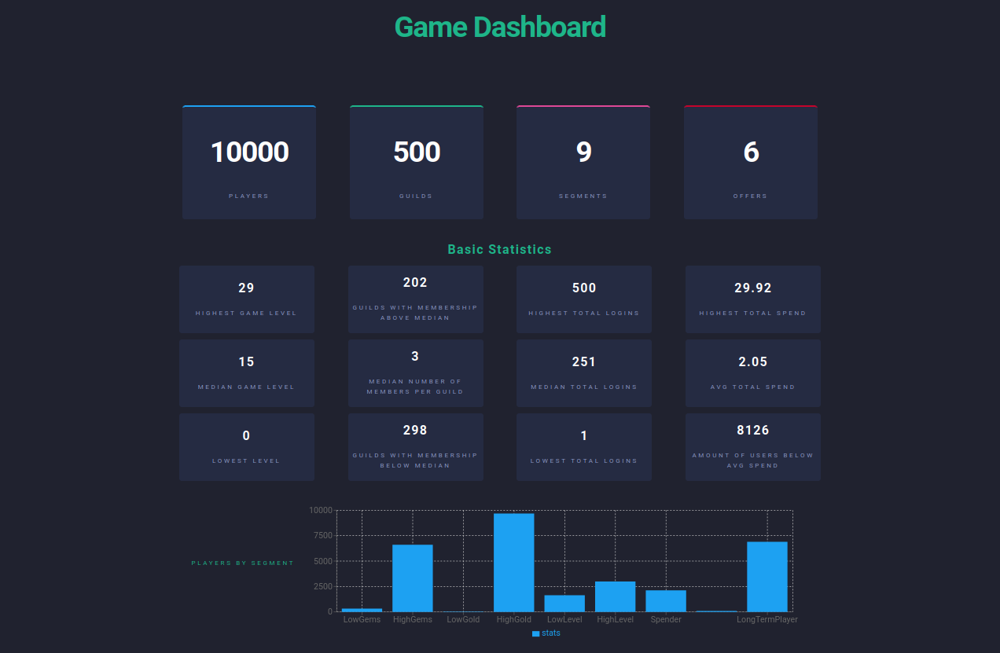

# metademo

## The Challenge

The challenge in this project was to create a simple web based dashboard that would used to explore a dataset provided by [metaplay](https://metaplay.io/). The dashboard provides user with statistics that provide insights into the game players metrics.

## Overall Architecture
- Database: A JSON [server](https://github.com/typicode/json-server) is used to store and serve the data.
- Backend: A Nodejs server where descriptive statistics(min, max, mean, median) and analytics are computed and served though RESTFul endpoints. 
- Frontend: A React app used to present the statistics in form of a dashboard, the re-charts React library is used to create graphing components for the app.

## Seting up the project

### Database
- Install JSON server and ensure the Resources (/players, /guilds, segments and /offers) are available
```
npm install -g json-server
npx json-server --watch <data_file.json>
```
More instructions on installing JSON Server can be found [here](https://github.com/typicode/json-server)

### Backend Setup
Ensure nodes run-time version 16.X or above is installed.

Move to the Server folder
Install all dependencies 
```
npm install
```
- Run the app by
```
node index
```

PS: In Ubuntu  20.4 this can be abit challenging to get the correct versions installed as seen in this github [issue](https://github.com/nodesource/distributions/issues/1181) due to some seemingly missing public key signatures.

### Frontend Setup
To setup and start the front end app, start by installing the dependencies in the root folder (meta_demo)

```
npm install
```
Start the app 
```
npm start
``` 

## App Visibility
If all installations are successfull and the JSON Server from [http://localhost:3000](http://localhost:3000) and Node Server from [http://localhost:3030](http://localhost:3030) are running, the app can be viewed from [http://localhost:3001](http://localhost:3001) to view it in your browser.




The app runs the client side of the app in the development mode.
